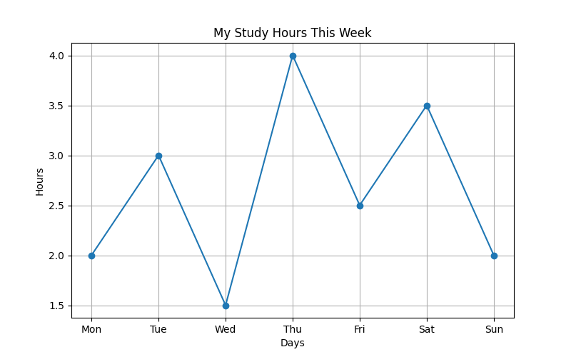

# Study Hours Tracker 📊

This project is a simple Python application that tracks weekly study hours and visualizes them using Matplotlib.

## 🔧 Features
- Input daily study hours
- Calculate average study time
- Generate a line chart visualization

## 🛠 Technologies
- Python
- Matplotlib

## 📈 Output
The program generates a visual chart like this:

## 🎯 Purpose
I built this project to improve my Python skills and learn basic data visualization.
